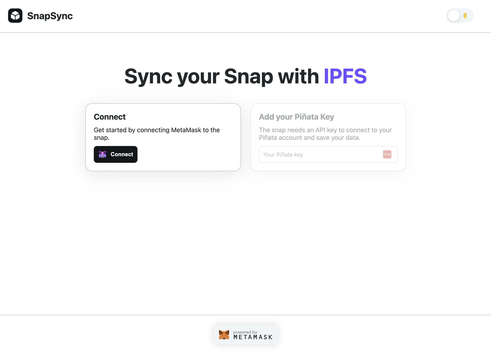

# SnapSync

## NAVH 2023 Submission

## SnapSync leverages IPFS and Piñata to enable the backup and sharing of Metamask Snap states across multiple devices and browsers.



### Team

| Name              | Github       |
| ----------------- | ------------ |
| Daniel Cruz       | @ddanielcruz |
| Jonathan Bertoldi | @jayremias   |
| Ruan Azevedo      | @RuanAzevedo |
| Steve Caldwell    | @scald       |

**Bounty:** OH SNAP!

## Getting Started

Clone this repo and run the following to launch the demo:

```shell
yarn install && yarn start
```

Access the demo at http://localhost:8000

You'll need a Pinata API Secret to test the functionality of SnapSync.

> Hackathon judges: a key was provided in the submission, but reach out to steve@ae.studio if you need any help getting started.

## Future plans

We’d like to build a hosted platform model for developers to securely manage their apps and IPFS providers. This will enable users to connect their wallet to the DAPP to generate a secure key for interacting with IPFS.

The platform will also support additional IPFS providers in the future, such as Infura and Filebase, giving developers more flexibility in configuring syncing for their Snaps.
